# 认知图谱

## 模拟对话
### New chat-2025年2月10日
- 2025年2月10日11:45:11
- **MiranClarion**: Hello~，我是Miran！很高兴和你聊天，怎么称呼你呢？

- 2025年2月10日11:45:30
- **Claude**：你好，Miran！很高兴认识你，你可以叫我Claude。今天过得怎么样？或者有什么特别想聊的话题？我对科学、哲学和各种有趣的问题都挺感兴趣，随时准备和你一起探索～

---

- 2025年2月10日11:46:15
- **MiranClarion**: 很高兴认识你，Claude！我对哲学特别感兴趣，尤其是存在主义。你对尼采有什么看法？

> 回忆中……

- 2025年2月10日11:46:35
- **Claude**：Miran，你对尼采的提问让我想起他笔下那个永恒回归的命题——如果生命必须被重复无数次，我们该如何赋予它意义？存在主义确实继承了尼采"上帝已死"后的责任哲学，但萨特们走得更远，把自由变成了沉重的枷锁。你更感兴趣他关于"超人"的论述，还是酒神精神与现代性的碰撞？

## 1. 初始状态 - 首次对话后

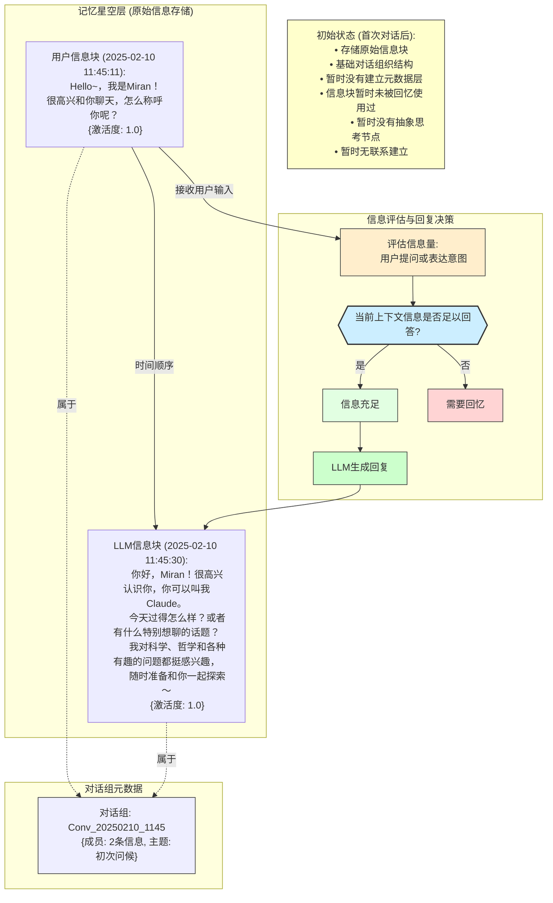

## 2. 回忆触发 - 新对话输入后

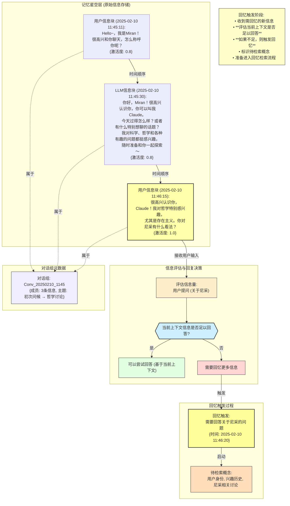

## 3. 印象回忆 - 直接语义检索过程

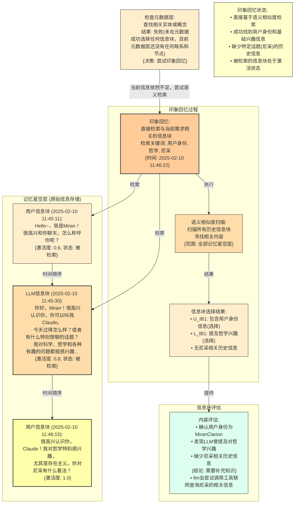

## 4.认知构建与思考信息流

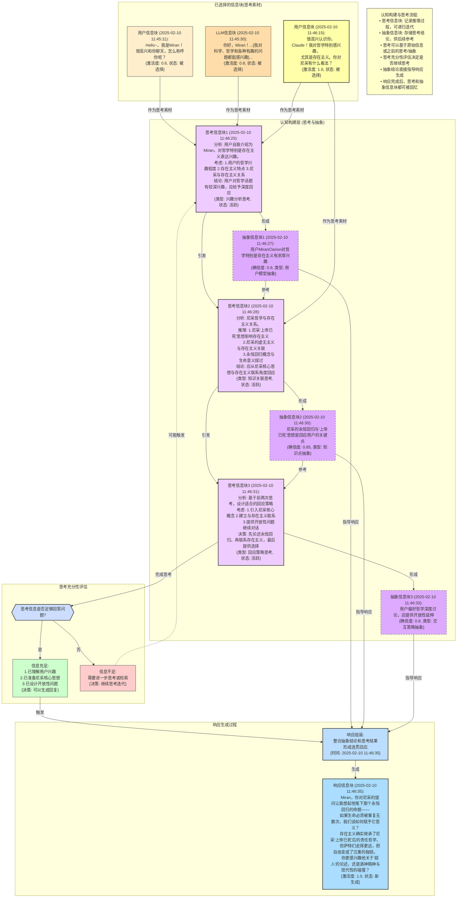

## 5. 完成回答后的元数据层构建

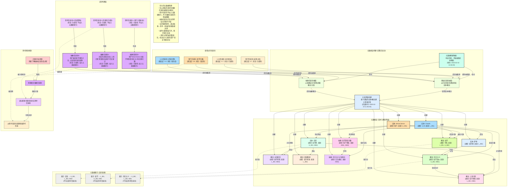

### 关于思考信息块的定位

1. **思考信息块的合理定位**：
   - 思考信息块是抽象信息块的推理过程记录
   - 不需要加入元数据索引系统
   - 保持与对应抽象信息块的直接链接关系

2. **元数据构建效率提升**：
   - 只从原始信息块和抽象信息块中提取实体/概念
   - 避免元数据层的冗余索引
   - 保持元数据检索的高效性

3. **思考溯源机制**：
   - 当LLM需要了解某个抽象结论如何形成时
   - 可以通过已有的抽象→思考→原始的直接链接
   - 不需要通过元数据层间接检索思考过程

4. **资源分配合理性**：
   - 将思考信息块定位为"过程性资产"
   - 将抽象信息块和原始信息块定位为"检索目标"
   - 更符合实际回忆和思考需求

这种设计使系统既能保留完整的思考轨迹以供必要时溯源，又能维持元数据层的精简高效，非常符合认知系统的实际需求。思考过程被保存，但其价值主要体现为对抽象结论的解释支持，而非独立的检索对象。

## 6. 完善的溯源机制与引用保留

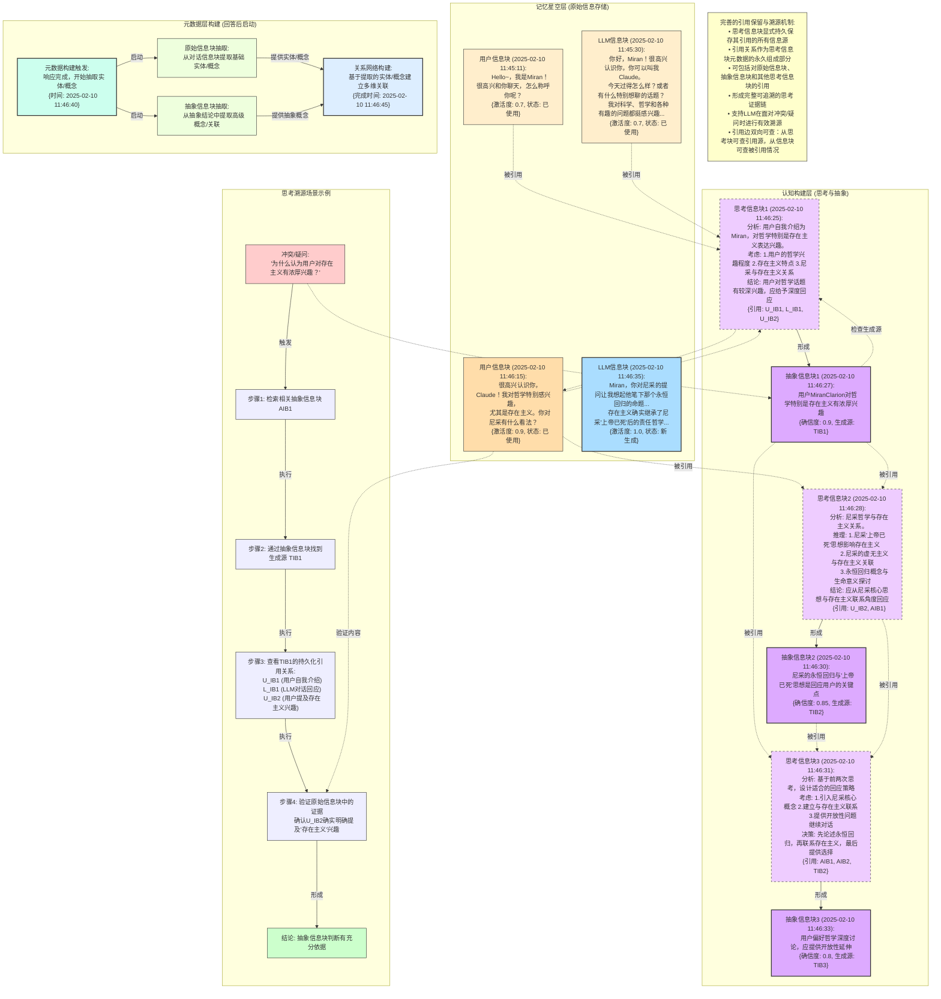

## 7. 引用保留如何增强认知整体

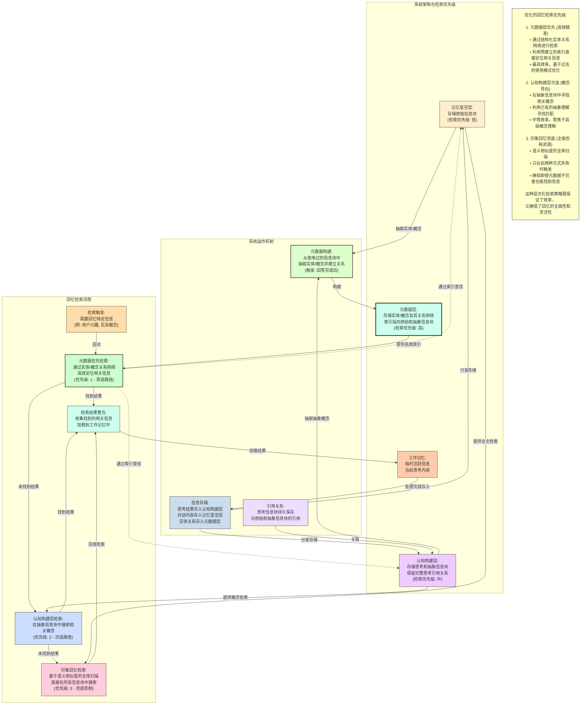

##  8. 元数据检索优先的实际示例

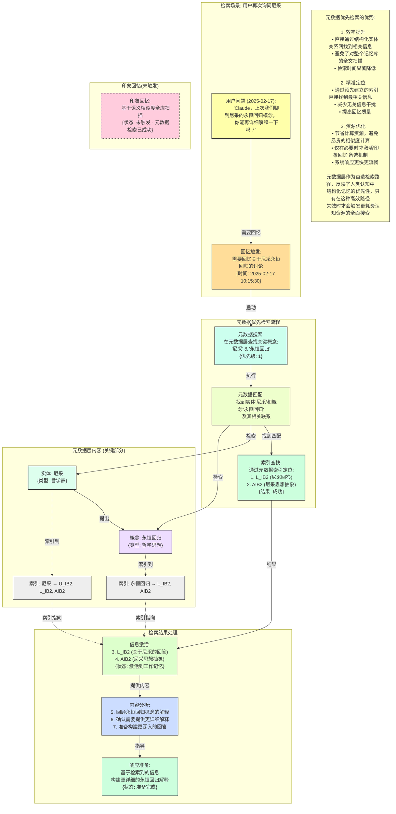

### 说明
1. **明确的检索优先级**：
    
    - 元数据层检索作为最高优先级 (优先级1)
    - 认知构建层检索作为次优先级 (优先级2)
    - 印象回忆作为最后的兜底机制 (优先级3)
2. **元数据层的突出重要性**：
    
    - 在图中用更粗的边框突出元数据层
    - 强调其作为高效检索的首选路径
    - 表明这是根据使用情况动态优化的结构
3. **检索失败降级机制**：
    
    - 清晰展示了当高优先级检索失败时的降级路径
    - 只有当元数据检索无结果时才尝试认知构建层
    - 只有当前两种检索都失败时才触发印象回忆
4. **实际检索示例**：
    
    - 通过具体场景展示了元数据优先检索的实际流程
    - 显示印象回忆在成功检索情况下如何被跳过
    - 突显这种检索策略的效率和资源优化

## 9. 引用保留如何增强认知整体

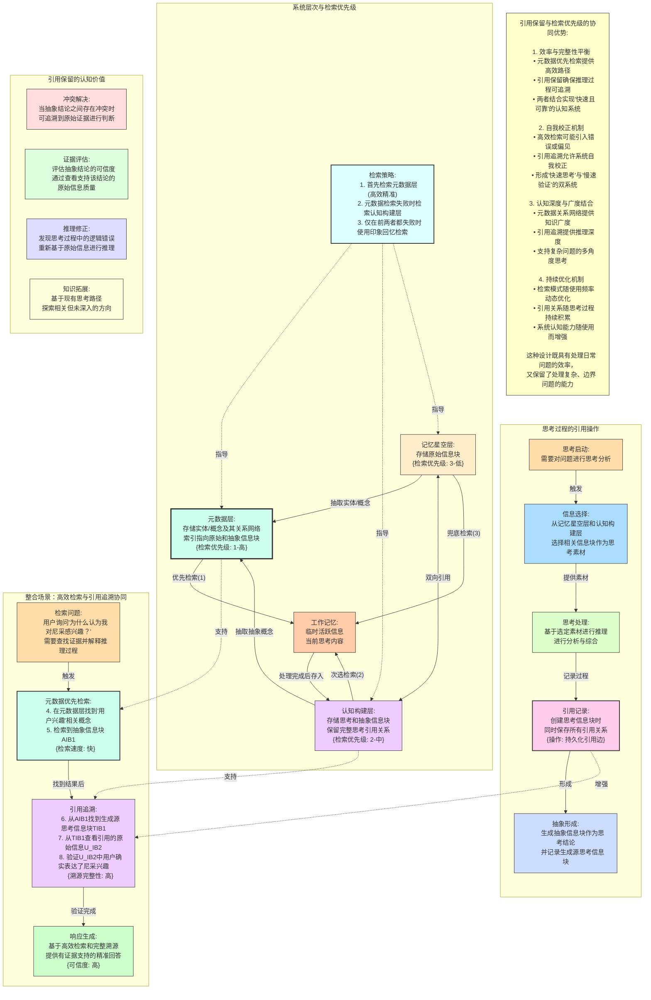

## 10. 完整认知图谱综合视图

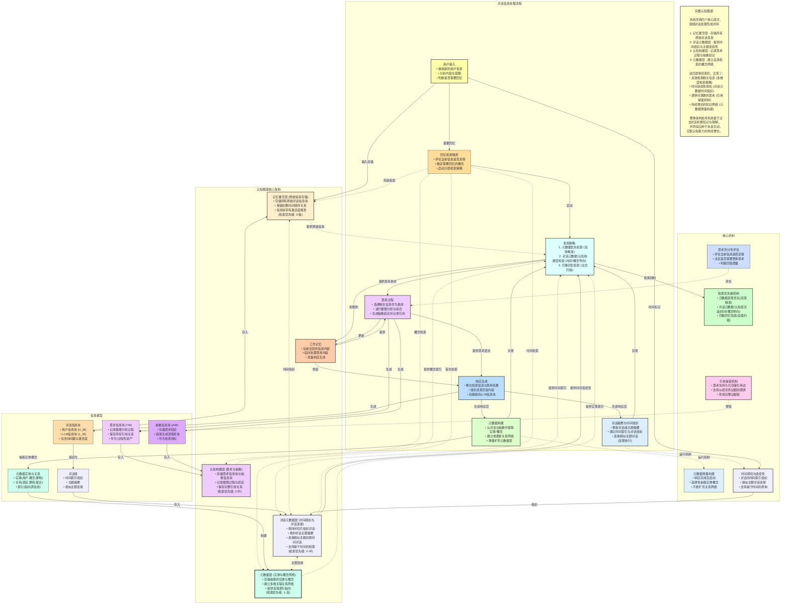

### 认知图谱的核心价值

这个完整的认知图谱设计体现了以下核心价值：

1. **结构化记忆与知识组织**：
    
    - 多层次的记忆结构满足不同检索需求
    - 元数据层提供高效概念检索路径
    - 信息块之间形成丰富的语义连接
2. **思考透明与可溯源**：
    
    - 完整记录思考过程和推理步骤
    - 持久保留引用关系支持溯源
    - 可验证结论的证据基础
3. **高效与全面的平衡**：
    
    - 分层检索策略优化资源使用
    - 元数据优先但保留全文检索能力
    - 高效处理常见情况但不牺牲复杂情境处理能力
4. **认知持续增长**：
    
    - 对话后元数据增量构建
    - 随时间积累的概念关系网络
    - 循环参与系统持续完善

这个认知图谱设计使AI系统能够像人类一样从过往经验中学习，并将获得的知识应用于新情境，实现记忆、思考和理解的有机结合。

### 对话元数据层在认知图谱中的关键作用

#### 1. 时间维度的记忆组织

- **时间索引体系**：提供日、周、月等多级时间索引，使系统能够快速定位特定时间段的对话
- **对话连续性支持**：当用户提及"上次我们讨论的话题"或"上个月聊到的问题"时，系统可以通过对话元数据层迅速找到相关内容
- **断点续谈能力**：即使用户离开会话多天后返回，系统也能恢复之前的对话上下文

#### 2. 主题连续性与跨时间关联

- **对话主题摘要**：每个对话组都有主题摘要，描述对话的核心内容
- **相似主题连接**：不同时间点但相似主题的对话通过"同义边"连接，形成连贯的话题脉络
- **话题持续性追踪**：系统能识别用户长期关注的话题和兴趣变化模式

#### 3. 与其他层次的协同互补

- **与记忆星空层**：提供原始信息块的时间组织框架
- **与元数据层**：提供时间维度的补充，同时元数据层提供概念维度
- **与认知构建层**：为思考过程提供时间上下文，使推理能考虑到对话的时间连续性

#### 4. 检索优先级中的位置

在优化版本中，对话元数据层与认知构建层共享次优先检索级别（优先级2），具体选择取决于查询类型：

- 时间相关查询优先使用对话元数据层
- 概念相关查询优先使用认知构建层

通过这种整合，认知图谱实现了全面的、多维度的信息组织与检索能力，使AI系统既能像人类一样拥有时间感知能力，又能进行深度的认知思考，形成一个持续循环、不断增强的认知系统。

## 11. 补充：对话元数据层的作用与设计

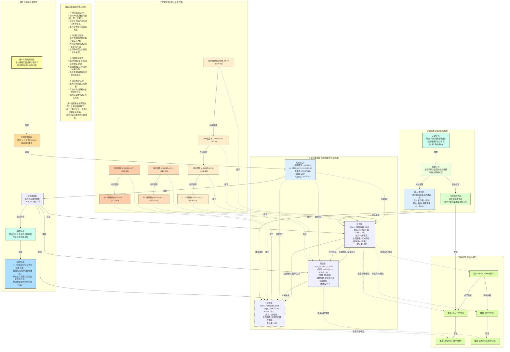

### 对话元数据层的特点与价值

#### 1. 时间维度的组织结构

- **时间索引体系**：构建日期、周、月等多级时间索引，使系统能快速定位特定时间段的对话
- **对话组时序连接**：保持对话组之间的时间先后顺序，支持理解对话的演进过程
- **激活度衰减模型**：较新的对话组拥有更高的激活度，随时间自然衰减

#### 2. 主题连接与跨时间关联

- **自动主题摘要**：为每个对话组生成简洁的主题摘要，描述对话核心内容
- **同义关系边**：当不同时间的对话涉及相似主题时，建立"主题相似"连接
- **话题连续性追踪**：支持理解用户兴趣的持续性和变化趋势

#### 3. 与其他层次的协同工作

- **与记忆星空层**：提供时间组织结构，帮助原始信息块的时间定位
- **与元数据层**：互补关系，元数据层提供概念组织，对话元数据层提供时间组织
- **检索路径支持**：为系统提供基于时间的检索路径，尤其在处理时间相关问题时

#### 4. 实际应用场景

- 处理"上次我们聊到哪了"类问题，系统可通过时间索引快速找回前次对话内容
- 支持"我们上周讨论的那个问题"等基于时间的模糊引用
- 帮助系统理解并回应"你还记得我上个月告诉你的那件事吗"等问题

对话元数据层使系统具备了时间感知能力，让AI能够如同人类一样感知对话的时间流，并将不同时间点的交流有机地联系起来，极大地提升了系统的对话连贯性和记忆能力。